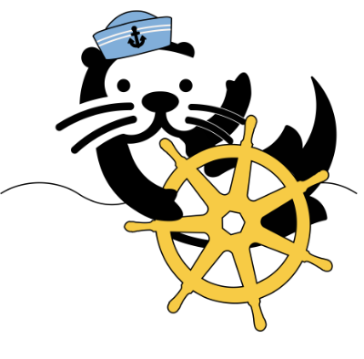

# Otterize Credentials Operator




[](https://joinslack.otterize.com)

[About](#about) | [Quick tutorial](https://docs.otterize.com/quickstart/access-control/k8s-kafka-mtls-cert-manager) | [How does the Credentials Operator work?](#how-does-the-credentials-operator-work) | [Docs](https://docs.otterize.com/reference/configuration/credentials-operator) | [Contributing](#contributing) | [Slack](#slack)

___

## About

The Otterize Credentials Operator automatically resolves pods to dev-friendly service names, registers them with a SPIRE server or with Otterize Cloud, and optionally provisions credentials as Kubernetes secrets.

## How does the Credentials operator work?

### Service entry registration

Once the operator [resolves the service name](#service-name-resolution-and-automatic-pod-labeling) for a pod, it labels the pod and registers an entry with the SPIRE server or with Otterize cloud.

### Credentials generation

After the operator has registered the pod, which happens automatically upon startup, the pod can use the SPIRE Workload API or Otterize Cloud to generate x509 Certificate with `<servicename>.<namespace>` as its CN.

Additionally, the operator consults the label `credentials-operator.otterize.com/tls-secret-name`. If that label exists, the operator creates a secret named after the value of the label with X.509 credentials within (SVID if you use SPIRE). This way, the pod can get autogenerated credentials without modifying its code.

For more information, see the [docs](https://docs.otterize.com/reference/configuration/credentials-operator).

### Service name resolution and automatic pod labeling

Service name resolution is performed one of two ways:

1. If an `intents.otterize.com/service-name` annotation is present, that name is used.
2. If not, a recursive lookup is performed for the Kubernetes resource owner for a Pod until the root is reached. For example, if you have a `Deployment` named `client`, which then creates and owns a `ReplicaSet`, which then creates and owns a `Pod`, then the service name for that pod is `client` - same as the name of the `Deployment`.

The value resulting from this process forms the value of the label `credentials-operator.otterize.com/service-name`.

### AWS IAM

The credentials operator, together with the [intents operator](https://github.com/otterize/intents-operator), enables the intent-based declarative management of AWS IAM roles and policies.

To generate an AWS IAM role for a pod, apply the following label to it:

```yaml
metadata:
 labels:
  "credentials-operator.otterize.com/create-aws-role": "true"
```

Try the [AWS IAM tutorial](https://docs.otterize.com/quickstart/access-control/aws-iam-eks) to learn more.

### Azure IAM

The credentials operator, together with the [intents operator](https://github.com/otterize/intents-operator), enables the intent-based declarative management of Azure IAM identities and role assignments.

To generate an Azure managed identity for a pod, apply the following label to it:

```yaml
metadata:
 labels:
  "credentials-operator.otterize.com/create-azure-workload-identity": "true"
```

Try the [Azure IAM tutorial](https://docs.otterize.com/features/azure-iam/tutorials/azure-iam-aks) to learn more.

### Google Cloud IAM

The credentials operator, together with the [intents operator](https://github.com/otterize/intents-operator), enables the intent-based declarative management of Google Cloud service accounts and policies.

To generate a Google Cloud service account for a pod, apply the following label to it:

```yaml
metadata:
 labels:
  "credentials-operator.otterize.com/create-gcp-sa": "true"
```

Try the [GCP IAM tutorial](https://docs.otterize.com/features/gcp-iam/tutorials/gcp-iam-gke) to learn more.

### Database just-in-time access

The credentials operator, together with the [intents operator](https://github.com/otterize/intents-operator), enables the intent-based declarative management of just-in-time database credentials and access permissions.
This feature is currently supported for PostgreSQL and MySQL databases.

Try the following tutorials to learn more:

- [PostgreSQL JIT access](https://docs.otterize.com/features/postgresql/tutorials/postgres)
- [MySQL JIT access](https://docs.otterize.com/features/mysql/tutorials/mysql)

## Contributing

1. Feel free to fork and open a pull request! Include tests and document your code in [Godoc style](https://go.dev/blog/godoc).
2. In your pull request, please refer to an existing issue or open a new one.
3. For instructions on developing for the operator, see the [README for that section](src/operator/README.md).
4. See our [Contributor License Agreement](https://github.com/otterize/cla/).

## Slack

[Join the Otterize Slack!](https://joinslack.otterize.com)
