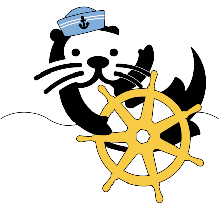

# Otterize intents operator 




[](https://goreportcard.com/report/github.com/otterize/intents-operator/src)
[](https://joinslack.otterize.com)

* [About](#about) 
* [Quickstart & Docs](https://docs.otterize.com/)
* [How does the intents operator work?](#how-does-the-intents-operator-work)
  * [Network policies](#network-policies)
  * [AWS IAM policies](#aws-iam-policies)
  * [Kafka mTLS & ACLs](#kafka-mtls--acls)
  * [Deducing workload identities](#identities)
* [Bootstrapping](#bootstrapping)
* [Read more](#read-more)
* [Development](#development)
* [Contributing](#contributing)
* [Slack](#slack)


## About
The Otterize intents operator is a tool used to easily automate the creation of network policies and Kafka ACLs
in a Kubernetes cluster using a human-readable format, via a custom resource.

Users declare each client's intents to access specific servers (represented as the kind `ClientIntents`); 
the operator automatically labels the relevant pods accordingly, 
and creates the corresponding network policies and Kafka ACLs.

Here is an example of a `ClientIntents` resource enabling traffic from `my-client` to `web-server` and `kafka-server`:
```yaml
apiVersion: k8s.otterize.com/v1alpha3
kind: ClientIntents
metadata:
  name: intents-sample
spec:
  service:
    name: my-client
  calls:
    - name: web-server
    - name: kafka-server
      type: kafka
```

## How does the intents operator work?

### Network policies
The intents operator automates the creation, management, and deletion of network policies based on user-defined client intents. To track the services it manages, it assigns labels to pods. These labels are derived from the pod's metadata, specifically combining the name of its top-level owner (e.g., a Kubernetes deployment) and the namespace where it's deployed. This unique identifier is then used within the generated network policies. The operator handles both **Ingress** and **Egress** traffic.

In the network policy detailed below, we can see an example of Ingress definitions. Two separate policies are defined for the backend and frontend services within the `otterize-example` namespace, each designed to strictly control ingress traffic based on pod labels.

The first policy, named `backend-access`, targets pods labeled as part of the backend service identified by the label `intents.otterize.com/service: backend-otterize-example-cfd8cd`. It restricts ingress traffic to these pods to only come from other pods within the same namespace that are explicitly authorized with the label `intents.otterize.com/access-backend-otterize-example-cfd8cd: "true"`. This ensures that only designated pods can communicate with the backend.

The second policy, named `frontend-access`, applies similar restrictions for the frontend service, targeting pods labeled `intents.otterize.com/service: frontend-otterize-example-5ad0ab.` It permits ingress from pods within the same namespace that have the label `intents.otterize.com/access-frontend-otterize-example-5ad0ab: "true"`. This ensures that only pods with specific permissions can access the frontend service.
```yaml
apiVersion: networking.k8s.io/v1
kind: NetworkPolicy
metadata:
  labels:
    intents.otterize.com/network-policy: backend-otterize-example-cfd8cd
  name: backend-access
  namespace: otterize-example
spec:
  ingress:
  - from:
    - namespaceSelector:
        matchLabels:
          kubernetes.io/metadata.name: otterize-example
      podSelector:
        matchLabels:
          intents.otterize.com/access-backend-otterize-example-cfd8cd: "true"
  podSelector:
    matchLabels:
      intents.otterize.com/service: backend-otterize-example-cfd8cd
  policyTypes:
  - Ingress
---
apiVersion: networking.k8s.io/v1
kind: NetworkPolicy
metadata:
  labels:
    intents.otterize.com/network-policy: frontend-otterize-example-5ad0ab
  name: frontend-access
  namespace: otterize-example
spec:
  ingress:
  - from:
    - namespaceSelector:
        matchLabels:
          kubernetes.io/metadata.name: otterize-example
      podSelector:
        matchLabels:
          intents.otterize.com/access-frontend-otterize-example-5ad0ab: "true"
  podSelector:
    matchLabels:
      intents.otterize.com/service: frontend-otterize-example-5ad0ab
  policyTypes:
  - Ingress

```

<details>
<summary>View related client intent source</summary>

```yaml
apiVersion: k8s.otterize.com/v1alpha3
kind: ClientIntents
metadata:
  name: frontend
  namespace:  otterize-example
spec:
  service:
    name: frontend
  calls:
    - name: backend
---
apiVersion: k8s.otterize.com/v1alpha3
kind: ClientIntents
metadata:
  name: backend
  namespace: otterize-example
spec:
  service:
    name: backend
  calls:
    - type: internet
      internet:
        domains:
          - api.exampleservice.com
    - name: frontend
```
</details>

For more usage example see the [network policy](https://docs.otterize.com/quick-tutorials/k8s-network-policies) and [egress policy automation](/features/network-mapping-network-policies/tutorials/k8s-egress-access-control-tutorial) tutorials.

### Client intents and DNS

When a client intents is specified using DNS identifiers, such as `api.exampledomain.com` in the example above, it initiates a sequence of operations between the [network mapper](https://github.com/otterize/network-mapper) and the intents operator to integrate the relevant IP addresses into the appropriate `NetworkPolicies`.

1. The network mapper incorporates a DNS cache layer, which identifies and stores all resolved DNS records alongside their corresponding IPv4 and IPv6 IP addresses.
2. Without a client intents associated with the given domain or its related IP addresses, the network mapper will propose a policy tailored to the observed traffic.
3. Upon applying a client intents with a domain name found in the cache, the network mapper dynamically updates the intent’s `status` section at one-second intervals with any newly identified IP addresses. It is important to note that the network mapper retains all previously identified IP addresses to ensure backward compatibility.
4. The intents operator reviews changes within the `status` section and amends the associated network policy to include these newly discovered IP addresses.


### AWS IAM policies
The intents operator, together with the [credentials operator](https://github.com/otterize/credentials-operator), enables the intent-based declarative management of AWS IAM roles and policies.

It's just two steps:
1. Label a pod to have an AWS role created for it:
```
metadata:
 labels:
  "credentials-operator.otterize.com/create-aws-role": "true"
```

2. Declare ClientIntents to specify which AWS resources it needs access to:
```yaml
apiVersion: k8s.otterize.com/v1alpha3
kind: ClientIntents
metadata:
  name: server
spec:
  service:
    name: server
  calls:
    - name: arn:aws:s3:::otterize-tutorial-bucket-*/*
      type: aws
      awsActions:
        - "s3:PutObject"
```

Done! The pod can access AWS. Try the [AWS IAM tutorial](https://docs.otterize.com/quickstart/access-control/aws-iam-eks) to learn more.

### Otterize for PostgreSQL
Otterize automates PostgreSQL access management and secrets for your workloads, all in Kubernetes.

Here is how:
1. Annotate a pod, requesting a user and a password to be provisioned and bound to the pod.

Annotate the pod with this annotation:

`credentials-operator.otterize.com/user-password-secret-name: booking-service-secret`

2. Declare your workload’s ClientIntents, specifying desired permissions.

```yaml
apiVersion: k8s.otterize.com/v1alpha3
kind: ClientIntents
metadata:
  name: booking-service
  namespace: flight-search
spec:
  service:
    name: booking-service
  calls:
    - name: bookings
      type: database
      databaseResources:
        - table: users
          databaseName: bookings-db
          operations:
            - SELECT
        - table: products
          databaseName: bookings-db
          operations:
            - ALL
```

Otterize then creates a user and matching grants on the target database.

Try the [Just-in-time PostgreSQL users & access](https://docs.otterize.com/quickstart/access-control/postgresql) to learn more.

### Kafka mTLS & ACLs
The intents operator automatically creates, updates, and deletes ACLs in Kafka clusters running within your Kubernetes cluster. 
It works with the [credentials operator](https://github.com/otterize/credentials-operator) to automatically:
- Establish pod service identities.
- Generate trusted credentials for each client service.
- Deliver the credentials to the pod's containers within a locally-mounted volume.

With Kafka, you can also control access to individual topics, like so:
```yaml
apiVersion: k8s.otterize.com/v1alpha3
kind: ClientIntents
metadata:
  name: kafka-sample
spec:
  service:
    name: my-client
  calls:
    - name: kafka-server
      type: kafka
      kafkaTopics:
        - name: orders
          operations: [ produce ]
```

Read more about it in the [secure Kafka access tutorial](https://docs.otterize.com/quick-tutorials/k8s-kafka-mtls).

### Istio AuthorizationPolicy
The intents operator automatically creates, updates and deletes Istio authorization policies, automatically looks up service accounts for client pods and labels server pods, to reflect precisely the client-to-server calls declared in client intents files.

The intents operator can also be configured to process client intents *without* creating and managing network policies, to provide visibility on what would happen once enforcement via Istio authorization policy is activated. More information can be found in the [shadow vs active enforcement documentation](https://docs.otterize.com/shadow-vs-active-enforcement).

In the example above, the `my-client` service intends to call the `web-server`. When the CRD is applied through `kubectl apply`, the intents operator labels the `web-server` pod, looks up `my-client`'s service account, and creates an authorization policy for the `web-server` that references the service account for `my-client` and allows calls to the `web-server` from the `my-client`.

The intents operator uses the resolved identity as the service name, and combines it with the namespace of the pod and hashed to form the value of the label `intents.otterize.com/server`.
This label is used as a selector for servers in Istio authorization policies. The same algorithm is used to look up the client from the service name in the client intents, for whom the service account is looked up.

Finally, an Istio authorization policy is created that allows communication between the client's service account and the server. If the service account covers clients other than the one requested, an event is generated on the ClientIntents to warn about this, and this appears as a warning on Otterize Cloud.

Read more about it in the [Istio AuthorizationPolicy tutorial](https://docs.otterize.com/quick-tutorials/k8s-istio-authorization-policies).

### Identities
Pods in the cluster are dynamically labeled with their owner's identity. If a `ReplicaSet` named `my-client` owns 5 pods
and a `Deployment` named `my-server` owns 3 pods, and we enable `my-client` &rarr; `my-server` access via `ClientIntents`, all 5
source pods would be able to access all 3 target pods.

Pod identities can be overridden by setting the value of the custom annotation `intents.otterize.com/service-name`
to the desired service name. This is useful, for example, for pods without any owner.


## Bootstrapping
To bootstrap client intents files for the services running in your cluster, you can use the [Otterize network 
mapper](https://github.com/otterize/network-mapper), which automatically detects pod-to-pod calls.

## Read more
The Otterize intents operator is a part of [Otterize OSS](https://otterize.com/open-source) 
and is an implementation of [intent-based access control](https://otterize.com/ibac).

## Development
Run the `make` command inside `src/operator` directory. Some useful commands are:
* `make build` to compile the go code.
* `make deploy` to generate Kubernetes Deployment object which deploys the project to your local cluster.

To create a local Docker image, execute `make docker-build-local`, and deploy it to your local cluster using `make deploy-local`.
For utilizing the locally built Docker image on Minikube running on a VM like macOS arm64, use `make minikube-push`.

## Contributing
1. Feel free to fork and open a pull request! Include tests and document your code in [Godoc style](https://go.dev/blog/godoc)
2. In your pull request, please refer to an existing issue or open a new one.
3. Changes to Kubernetes objects will make changes to the Helm chart in the [helm-charts repo](https://github.com/otterize/helm-charts), 
which is a submodule in this repository, so you'll need to open a PR there as well.
4. See our [Contributor License Agreement](https://github.com/otterize/cla/).

## Slack
To join the conversation, ask questions, and engage with other users, join the Otterize Slack!

[](https://joinslack.otterize.com)

## Usage telemetry
The operator reports anonymous usage information back to the Otterize team, to help the team understand how the software is used in the community and what aspects users find useful. No personal or organizational identifying information is transmitted in these metrics: they only reflect patterns of usage. You may opt out at any time through a single configuration flag.

To **disable** sending usage information:
- Via the Otterize OSS Helm chart: `--set global.telemetry.enabled=false`.
- Via an environment variable: `OTTERIZE_TELEMETRY_ENABLED=false`.
- If running an operator directly: `--telemetry-enabled=false`.

If the `telemetry` flag is omitted or set to `true`, telemetry will be enabled: usage information will be reported.

Read more about it in the [Usage telemetry Documentation](https://docs.otterize.com/otterize-oss/usage-telemetry)
